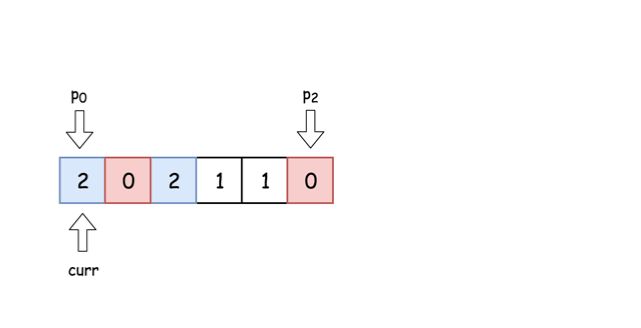

# 题目0075:颜色分类

## 题目描述

给定一个包含红色、白色和蓝色,一共n个元素的数组,原地对它们进行排序,使得相同颜色的元素相邻,并按照红色、白色、蓝色顺序排列。

此题中,我们使用整数0、1和2分别表示红色、白色和蓝色。

注意:不能使用代码库中的排序函数来解决这道题。

示例:

```
输入: [2,0,2,1,1,0]
输出: [0,0,1,1,2,2]
```

进阶:

> 一个直观的解决方案是使用计数排序的两趟扫描算法。
> 
> 首先,迭代计算出0、1和2元素的个数,然后按照0、1、2的排序,重写当前数组。
> 
> 你能想出一个仅使用常数空间的一趟扫描算法吗?

## 解题技巧

* **方法一:一次遍历**

本问题被称为[荷兰国旗问题](https://en.wikipedia.org/wiki/Dutch_national_flag_problem)
,最初由 Edsger W. Dijkstra提出。其主要思想是给每个数字设定一种颜色,并按照荷兰国旗颜色的顺序进行调整。


我们用三个指针(p0,p2和curr)来分别追踪0的最右边界,2的最左边界和当前考虑的元素。


本解法的思路是沿着数组移动curr指针,若nums[curr] = 0,则将其与nums[p0]互换;若nums[curr] = 2,则与nums[p2]互换。

算法:

> - 初始化0的最右边界:p0 = 0。在整个算法执行过程中nums[idx < p0] = 0.
> - 初始化2的最左边界:p2 = n - 1。在整个算法执行过程中nums[idx > p2] = 2.
> - 初始化当前考虑的元素序号:curr = 0.
> - While curr <= p2 :
>   + 若nums[curr] = 0:交换第curr个和第p0个元素,并将指针都向右移。
>   + 若nums[curr] = 2:交换第curr个和第p2个元素,并将p2指针左移 。
>   + 若nums[curr] = 1:将指针curr右移。

实现



```python
class Solution:
    def sortColors(self, nums: List[int]) -> None:
        '''
        荷兰三色旗问题解
        '''
        # 对于所有 idx < p0 : nums[idx < p0] = 0
        # curr是当前考虑元素的下标
        p0 = curr = 0
        # 对于所有 idx > p2 : nums[idx > p2] = 2
        p2 = len(nums) - 1

        while curr <= p2:
            if nums[curr] == 0:
                nums[p0], nums[curr] = nums[curr], nums[p0]
                p0 += 1
                curr += 1
            elif nums[curr] == 2:
                nums[curr], nums[p2] = nums[p2], nums[curr]
                p2 -= 1
            else:
                curr += 1
```

复杂度分析

> 时间复杂度:由于对长度N的数组进行了一次遍历,时间复杂度为O(N)。
> 
> 空间复杂度:由于只使用了常数空间,空间复杂度为O(1)。