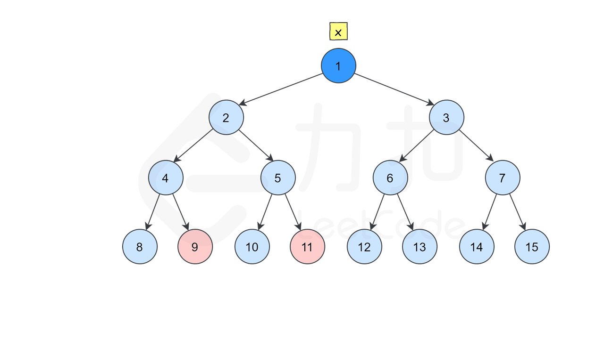

# 题目0236:二叉树的最近公共祖先
## 题目描述

给定一个二叉树,,找到该树中两个指定节点的最近公共祖先。

百度百科中最近公共祖先的定义为:"对于有根树T的两个结点p、q,最近公共祖先表示为一个结点x,满足x是p、q的祖先且x的深度尽可能大(一个节点也可以是它自己的祖先)。""

例如,给定如下二叉树: root = [3,5,1,6,2,0,8,null,null,7,4]


示例1:

```
输入: root = [3,5,1,6,2,0,8,null,null,7,4], p = 5, q = 1
输出: 3
解释: 节点 5 和节点 1 的最近公共祖先是节点 3。
```

示例2:

```
输入: root = [3,5,1,6,2,0,8,null,null,7,4], p = 5, q = 4
输出: 5
解释: 节点 5 和节点 4 的最近公共祖先是节点 5。因为根据定义最近公共祖先节点可以为节点本身。
```

说明:

> 所有节点的值都是唯一的。
> 
> p、q 为不同节点且均存在于给定的二叉树中。

## 解题技巧

<video src="images/d1bebd2259204338817078f5ebee5776ec9425ecfa859dd396f50bee6dfa3c34.mp4" controls />

* **方法一:递归**

思路和算法:我们递归遍历整棵二叉树,定义$f_x$表示x节点的子树中是否包含p节点或q节点,如果包含为true,否则为false。那么符合条件的最近公共祖先x一定满足如下条件:

$$(f_{\text{lson}}\ \&\&\ f_{\text{rson}})\ ||\ ((x\ =\ p\ ||\ x\ =\ q)\ \&\&\ (f_{\text{lson}}\ ||\ f_{\text{rson}}))$$

其中lson和rson分别代表x节点的左孩子和右孩子。初看可能会感觉条件判断有点复杂,我们来一条条看,$f_{\text{lson}}\ \&\&\ f_{\text{rson}}$说明左子树和右子树均包含p节点或q节点,如果左子树包含的是p节点,那么右子树只能包含q节点,反之亦然,因为p节点和q节点都是不同且唯一的节点，因此如果满足这个判断条件即可说明x就是我们要找的最近公共祖先。再来看第二条判断条件,这个判断条件即是考虑了x恰好是p节点或q节点且它的左子树或右子树有一个包含了另一个节点的情况,因此如果满足这个判断条件亦可说明x就是我们要找的最近公共祖先。

你可能会疑惑这样找出来的公共祖先深度是否是最大的。其实是最大的,因为我们是自底向上从叶子节点开始更新的,所以在所有满足条件的公共祖先中一定是深度最大的祖先先被访问到,且由于$f_x$本身的定义很巧妙,在找到最近公共祖先x以后,$f_x$按定义被设置为true,即假定了这个子树中只有一个p节点或q节点,因此其他公共祖先不会再被判断为符合条件。

下图展示了一个示例,搜索树中两个节点9和11的最近公共祖先。



```c++
/**
 * Definition for a binary tree node.
 * struct TreeNode {
 *     int val;
 *     TreeNode *left;
 *     TreeNode *right;
 *     TreeNode(int x) : val(x), left(NULL), right(NULL) {}
 * };
 */
class Solution {
public:
    TreeNode* ans;
    bool dfs(TreeNode* root, TreeNode* p, TreeNode* q) {
        if (root == nullptr) return false;
        bool lson = dfs(root->left, p, q);
        bool rson = dfs(root->right, p, q);
        if ((lson && rson) || ((root->val == p->val || root->val == q->val) && (lson || rson))) {
            ans = root;
        } 
        return lson || rson || (root->val == p->val || root->val == q->val);
    }
    TreeNode* lowestCommonAncestor(TreeNode* root, TreeNode* p, TreeNode* q) {
        dfs(root, p, q);
        return ans;
    }
};
```
复杂度分析

> 时间复杂度:O(N),其中N是二叉树的节点数。二叉树的所有节点有且只会被访问一次,因此时间复杂度为O(N)。
> 
> 空间复杂度:O(N),其中N是二叉树的节点数。递归调用的栈深度取决于二叉树的高度,二叉树最坏情况下为一条链,此时高度为N因此空间复杂度为O(N)。

* **方法二:存储父节点**

思路:我们可以用哈希表存储所有节点的父节点,然后我们就可以利用节点的父节点信息从p结点开始不断往上跳,并记录已经访问过的节点,再从q节点开始不断往上跳,如果碰到已经访问过的节点,那么这个节点就是我们要找的最近公共祖先。

算法

> 从根节点开始遍历整棵二叉树,用哈希表记录每个节点的父节点指针。
> 
> 从p节点开始不断往它的祖先移动,并用数据结构记录已经访问过的祖先节点。
> 
> 同样,我们再从q节点开始不断往它的祖先移动,如果有祖先已经被访问过,即意味着这是p和q的深度最深的公共祖先,即LCA节点。

```c++
/**
 * Definition for a binary tree node.
 * struct TreeNode {
 *     int val;
 *     TreeNode *left;
 *     TreeNode *right;
 *     TreeNode(int x) : val(x), left(NULL), right(NULL) {}
 * };
 */
class Solution {
public:
    unordered_map<int, TreeNode*> fa;
    unordered_map<int, bool> vis;
    void dfs(TreeNode* root){
        if (root->left != nullptr) {
            fa[root->left->val] = root;
            dfs(root->left);
        }
        if (root->right != nullptr) {
            fa[root->right->val] = root;
            dfs(root->right);
        }
    }
    TreeNode* lowestCommonAncestor(TreeNode* root, TreeNode* p, TreeNode* q) {
        fa[root->val] = nullptr;
        dfs(root);
        while (p != nullptr) {
            vis[p->val] = true;
            p = fa[p->val];
        }
        while (q != nullptr) {
            if (vis[q->val]) return q;
            q = fa[q->val];
        }
        return nullptr;
    }
};
```

复杂度分析

> 时间复杂度:O(N),其中N是二叉树的节点数。二叉树的所有节点有且只会被访问一次,从p和q节点往上跳经过的祖先节点个数不会超过 N,因此总的时间复杂度为O(N)。
> 
> 空间复杂度:O(N),其中N是二叉树的节点数。递归调用的栈深度取决于二叉树的高度,二叉树最坏情况下为一条链,此时高度为N因此空间复杂度为O(N),哈希表存储每个节点的父节点也需要O(N)的空间复杂度,因此最后总的空间复杂度为O(N)。