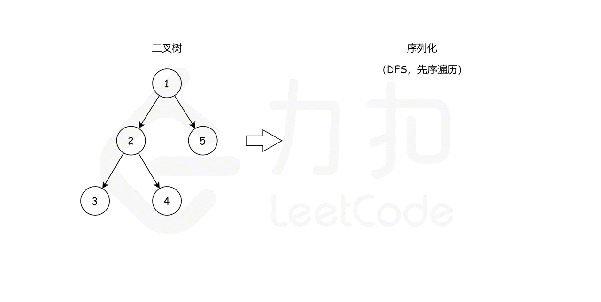

# 题目0297:二叉树的序列化与反序列化

## 题目描述

序列化是将一个数据结构或者对象转换为连续的比特位的操作,进而可以将转换后的数据存储在一个文件或者内存中,同时也可以通过网络传输到另一个计算机环境,采取相反方式重构得到原数据。

请设计一个算法来实现二叉树的序列化与反序列化。这里不限定你的序列/反序列化算法执行逻辑,你只需要保证一个二叉树可以被序列化为一个字符串并且将这个字符串反序列化为原始的树结构。

示例: 

```
你可以将以下二叉树：

    1
   / \
  2   3
     / \
    4   5

序列化为 "[1,2,3,null,null,4,5]"
```


说明:不要使用类的成员/全局/静态变量来存储状态,你的序列化和反序列化算法应该是无状态的。

## 解题技巧

* **方法一:深度优先搜索**

二叉树的序列化本质上是对其值进行编码,更重要的是对其结构进行编码。可以遍历树来完成上述任务。众所周知,我们一般有两个策略:BFS/DFS。

> * BFS可以按照层次的顺序从上到下遍历所有的节点
> * DFS可以从一个根开始,一直延伸到某个叶,然后回到根,到达另一个分支。根据根节点、左节点和右节点之间的相对顺序,可以进一步将DFS策略区分为:
>   + 先序遍历
>   + 中序遍历
>   + 后序遍历

这里,我们选择先序遍历的编码方式，我们可以通过这样一个例子简单理解:



我们从根节点1开始,序列化字符串是1,然后我们跳到根节点2的左子树,序列化字符串变成1,2,。现在从节点2 开始,我们访问它的左节点3(1,2,3,None,None,)和右节点4

(1,2,3,None,None,4,None,None)。None,None是用来标记缺少左、右子节点,这就是我们在序列化期间保存树结构的方式。最后,我们回到根节点1并访问它的右子树,它恰好是叶节点5。最后,序列化字符串是1,2,3,None,None,4,None,None,5,None,None,。

即我们可以先序遍历这颗二叉树,遇到空子树的时候序列化成None,否则继续递归序列化。那么我们如何反序列化呢?首先我们需要根据,把原先的序列分割开来得到先序遍历的元素列表,然后从左向右遍历这个序列:

> 如果当前的元素为None,则当前为空树
> 
> 否则先解析这棵树的左子树,再解析它的右子树

具体请参考下面的代码。代码

```java
public class Codec {
    public String rserialize(TreeNode root, String str) {
        if (root == null) {
            str += "None,";
        } else {
            str += str.valueOf(root.val) + ",";
            str = rserialize(root.left, str);
            str = rserialize(root.right, str);
        }
        return str;
    }
  
    public String serialize(TreeNode root) {
        return rserialize(root, "");
    }
  
    public TreeNode rdeserialize(List<String> l) {
        if (l.get(0).equals("None")) {
            l.remove(0);
            return null;
        }
  
        TreeNode root = new TreeNode(Integer.valueOf(l.get(0)));
        l.remove(0);
        root.left = rdeserialize(l);
        root.right = rdeserialize(l);
    
        return root;
    }
  
    public TreeNode deserialize(String data) {
        String[] data_array = data.split(",");
        List<String> data_list = new LinkedList<String>(Arrays.asList(data_array));
        return rdeserialize(data_list);
    }
}
```

复杂度分析

> 时间复杂度:在序列化和反序列化函数中,我们只访问每个节点一次,因此时间复杂度为O(n),其中n是节点数,即树的大小。
> 
> 空间复杂度:在序列化和反序列化函数中,我们递归会使用栈空间,故渐进空间复杂度为O(n)。

* **方法二:括号表示编码+递归下降解码**

我们也可以这样表示一颗二叉树:

> - 如果当前的树为空,则表示为X
> - 如果当前的树不为空,则表示为(<LEFT_SUB_TREE>)CUR_NUM(RIGHT_SUB_TREE),其中:
>   + <LEFT_SUB_TREE>是左子树序列化之后的结果
>   + <RIGHT_SUB_TREE>是右子树序列化之后的结果
>   + CUR_NUM是当前节点的值

根据这样的定义,我们很好写出序列化的过程,后序遍历这颗二叉树即可,那如何反序列化呢?根据定义,我们可以推导出这样的巴科斯范式(BNF):

```
T -> (T) num (T) | X
```

它的意义是:用T代表一棵树序列化之后的结果,|表示T的构成为(T)num(T)或者X,|左边是对T的递归定义,右边规定了递归终止的边界条件。

因为:

> - T的定义中,序列中的第一个字符要么是X,要么是(,所以这个定义是不含左递归的
> - 当我们开始解析一个字符串的时候,如果开头是X,我们就知道这一定是解析一个空树的结构,如果开头是(,我们就知道需要解析(T)num(T)的结构,因此这里两种开头和两种解析方法一一对应,可以确定这是一个无二义性的文法
> - 我们只需要通过开头的第一个字母是X还是(来判断使用哪一种解析方法

所以这个文法是LL(1)型文法,如果你不知道什么是LL(1)型文法也没有关系,你只需要知道它定义了一种递归的方法来反序列化,也保证了这个方法的正确性——我们可以设计一个递归函数:

> - 这个递归函数传入两个参数,带解析的字符串和当前当解析的位置ptr,ptr之前的位置是已经解析的,ptr和ptr后面的字符串是待解析的
> - 如果当前位置为X说明解析到了一棵空树,直接返回
> - 否则当前位置一定是(,对括号内部按照(T) num (T)的模式解析

具体请参考下面的代码。


```c++
/**
 * Definition for a binary tree node.
 * struct TreeNode {
 *     int val;
 *     TreeNode *left;
 *     TreeNode *right;
 *     TreeNode(int x) : val(x), left(NULL), right(NULL) {}
 * };
 */
class Codec {
public:
    string serialize(TreeNode* root) {
        if (!root) return "X";
        auto l = "(" + serialize(root->left) + ")";
        auto r = "(" + serialize(root->right) + ")";
        return  l + to_string(root->val) + r;
    }

    inline TreeNode* parseSubtree(const string &data, int &ptr) {
        ++ptr; // 跳过左括号
        auto subtree = parse(data, ptr);
        ++ptr; // 跳过右括号
        return subtree;
    }

    inline int parseInt(const string &data, int &ptr) {
        int x = 0, sgn = 1;
        if (!isdigit(data[ptr])) {
            sgn = -1;
            ++ptr;
        }
        while (isdigit(data[ptr])) {
            x = x * 10 + data[ptr++] - '0';
        }
        return x * sgn;
    }

    TreeNode* parse(const string &data, int &ptr) {
        if (data[ptr] == 'X') {
            ++ptr;
            return nullptr;
        }
        auto cur = new TreeNode(0);
        cur->left = parseSubtree(data, ptr);
        cur->val = parseInt(data, ptr);
        cur->right = parseSubtree(data, ptr);
        return cur;
    }

    TreeNode* deserialize(string data) {
        int ptr = 0;
        return parse(data, ptr);
    }
};
```

复杂度分析

> 时间复杂度:序列化时做了一次遍历,渐进时间复杂度为$O(n)$。反序列化时,在解析字符串的时候ptr指针对字符串做了一次顺序遍历,字符串长度为$O(n)$,故这里的渐进时间复杂度为$O(n)$。
> 
> 空间复杂度:考虑递归使用的栈空间的大小,这里栈空间的使用和递归深度有关,递归深度又和二叉树的深度有关,在最差情况下，二叉树退化成一条链,故这里的渐进空间复杂度为O(n)。