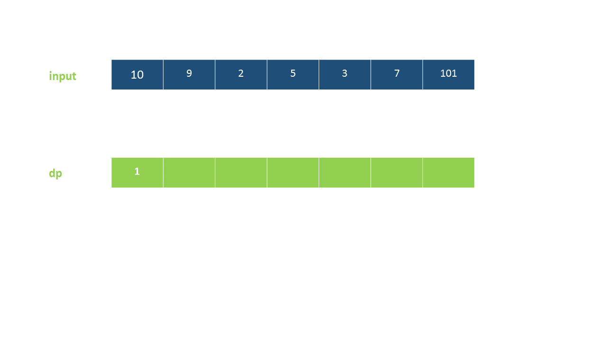

# 题目300:最长上升子序列

## 题目描述

给定一个无序的整数数组，找到其中最长上升子序列的长度。

示例:

```
输入: [10,9,2,5,3,7,101,18]
输出: 4 
解释: 最长的上升子序列是 [2,3,7,101]，它的长度是 4。
```

说明:可能会有多种最长上升子序列的组合,你只需要输出对应的长度即可。你算法的时间复杂度应该为O(n2)。

进阶: 你能将算法的时间复杂度降低到O(nlog n)吗?

## 解答技巧

* **动态规划**

定义`dp[i]`为考虑前`i`个元素,以第`i`个数字结尾的最长上升子序列的长度,注意$\textit{nums}[i]$必须被选取。

我们从小到大计算`dp[]`数组的值,在计算`dp[i]`之前,我们已经计算出$dp[0 \ldots i-1]$的值,则状态转移方程为:

$$dp[i] = \text{max}(dp[j]) + 1, \text{其中} \, 0 \leq j < i \, \text{且} \, \textit{num}[j]<\textit{num}[i]$$

即考虑往$dp[0 \ldots i-1]$中最长的上升子序列后面再加一个$\textit{nums}[i]$。由于$dp[j]$代表$\textit{nums}[0 \ldots j]$中以$\textit{nums}[j]$结尾的最长上升子序列,所以如果能从$dp[j]$这个状态转移过来,那么$\textit{nums}[i]$必然要大于$\textit{nums}[j]$,才能将$\textit{nums}[i]$放在$\textit{nums}[j]$后面以形成更长的上升子序列。

最后,整个数组的最长上升子序列即所有$dp[i]$中的最大值。

$$\text{LIS}_{\textit{length}}= \text{max}(dp[i]), \text{其中} \, 0\leq i < n$$

以下动画演示了该方法:



```c++
class Solution {
    public:
        int lengthOfLIS(vector<int>& nums) {
            int n=(int)nums.size();
            if (n == 0) return 0;
            vector<int> dp(n, 0);
            for (int i = 0; i < n; ++i) {
                dp[i] = 1;
                for (int j = 0; j < i; ++j) {
                    if (nums[j] < nums[i]) {
                        dp[i] = max(dp[i], dp[j] + 1);
                    }
                }
            }
            return *max_element(dp.begin(), dp.end());
        }
};
```

复杂度分析

> 时间复杂度:$O(n^2)$,其中`n`为数组$\textit{nums}$的长度。动态规划的状态数为`n`,计算状态$dp[i]$时,需要$O(n)$的时间遍历$dp[0 \ldots i-1]$的所有状态,所以总时间复杂度为$O(n^2)$。
> 
> 空间复杂度:$O(n)$,需要额外使用长度为`n`的`dp`数组。

* **贪心+二分查找**

考虑一个简单的贪心,如果我们要使上升子序列尽可能的长,则我们需要让序列上升得尽可能慢,因此我们希望每次在上升子序列最后加上的那个数尽可能的小。

基于上面的贪心思路,我们维护一个数组$d[i]$,表示长度为`i`的最长上升子序列的末尾元素的最小值,用$\textit{len}$记录目前最长上升子序列的长度,起始时`len`为`1`,$d[1] = \textit{nums}[0]$。

同时我们可以注意到`d[i]`是关于`i`单调递增的。因为如果$d[j] \geq d[i]$且$j < i$,我们考虑从长度为`i`的最长上升子序列的末尾删除`i-j`个元素,那么这个序列长度变为`j`,且第`j`个元素`x`(末尾元素)必然小于$d[i]$也就小于$d[j]$。那么我们就找到了一个长度为`j`的最长上升子序列,并且末尾元素比$d[j]$小,从而产生了矛盾。因此数组$d[]$的单调性得证。

我们依次遍历数组$\textit{nums}[]$中的每个元素,并更新数组$d[]$和`len`的值。如果$\textit{nums}[i] > d[\textit{len}]$则更新`len = len + 1`,否则在$d[1 \ldots len]$中找满足$d[i - 1] < \textit{nums}[j] < d[i]$的下标`i`,并更新$d[i] = \textit{nums}[j]$。

根据`d`数组的单调性,我们可以使用二分查找寻找下标`i`,优化时间复杂度。

最后整个算法流程为:

- 设当前已求出的最长上升子序列的长度为$\textit{len}$(初始时为`1`),从前往后遍历数组$\textit{nums}$,在遍历到$\textit{nums}[i]$时:
    - 如果$\textit{nums}[i] > d[\textit{len}]$,则直接加入到`d`数组末尾,并更新$\textit{len} = \textit{len} + 1$;
    - 否则,在`d`数组中二分查找,找到第一个比$\textit{nums}[i]$小的数$d[k]$,并更新$d[k + 1] = \textit{nums}[i]$。

以输入序列`[0, 8, 4, 12, 2]`为例:

> 第一步插入`0`,`d = [0]`;
>
> 第二步插入`8`,`d = [0, 8]`;
> 
> 第三步插入`4`,`d = [0, 4]`;
>
> 第四步插入`12`,`d = [0, 4, 12]`;
>
> 第五步插入`2`,`d = [0, 2, 12]`。
>
> 最终得到最大递增子序列长度为`3`。

```c++
class Solution {
public:
    int lengthOfLIS(vector<int>& nums) {
        int len = 1, n = (int)nums.size();
        if (n == 0) return 0;
        vector<int> d(n + 1, 0);
        d[len] = nums[0];
        for (int i = 1; i < n; ++i) {
            if (nums[i] > d[len]) d[++len] = nums[i];
            else{
                int l = 1, r = len, pos = 0; // 如果找不到说明所有的数都比 nums[i] 大，此时要更新 d[1]，所以这里将 pos 设为 0
                while (l <= r) {
                    int mid = (l + r) >> 1;
                    if (d[mid] < nums[i]) {
                        pos = mid;
                        l = mid + 1;
                    }
                    else r = mid - 1;
                }
                d[pos + 1] = nums[i];
            }
        }
        return len;
    }
};
```

复杂度分析

> 时间复杂度:$O(n\log n)$。数组$\textit{nums}$的长度为`n`,我们依次用数组中的元素去更新`d`数组,而更新`d`数组时需要进行$O(\log n)$的二分搜索,所以总时间复杂度为$O(n\log n)$。
> 
> 空间复杂度:$O(n)$,需要额外使用长度为`n`的`d`数组。
