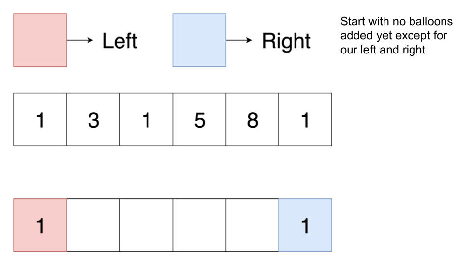

# 题目0312:戳气球

## 题目描述

有n个气球,编号为0到n-1,每个气球上都标有一个数字,这些数字存在数组nums中。

现在要求你戳破所有的气球。如果你戳破气球i,就可以获得nums[left] * nums[i] * nums[right]个硬币。这里的left和right代表和i相邻的两个气球的序号。注意当你戳破了气球i后,气球left和气球right就变成了相邻的气球。

求所能获得硬币的最大数量。

说明:你可以假设nums[-1] = nums[n] = 1,但注意它们不是真实存在的所以并不能被戳破。
0 ≤ n ≤ 500, 0 ≤ nums[i] ≤ 100

示例:

```
输入: [3,1,5,8]
输出: 167 
解释: nums = [3,1,5,8] --> [3,5,8] -->   [3,8]   -->  [8]  --> []
     coins =  3*1*5      +  3*5*8    +  1*3*8      + 1*8*1   = 167
```

## 解题技巧

这道题看起来最直接的做法就是暴力所有可能的扎破气球的顺序,但这个数量级很大,有$N \times (N - 1) \times (N - 2) \times ... \times 1$种可能,时间复杂度为$O(N!)$。这种最直接的暴力会有很多重复计算,比如有四个气球,你先扎破第一个再扎破第二个,跟你先扎破第二个在扎破第一个,最后都是剩下第三个和第四个气球,因此对于剩余第三个和第四个气球这种情况只需要计算一次就可以了。

有两种技巧可以继续优化解法:

分治: 在扎破第i个气球之后,可以把问题分割成第i个气球左边的部分(nums[0:i])和右边的部分(nums[i+1:])。为了找到全局最优解,需要检查扎破每个气球之后可能的最优解。首先需要尝试扎破区间内所有的气球去找到这个区间的最优解,然后再找到所有可能区间中的最优解,最终复杂度为$O(N) * O(N^2) = O(N^3)$。然而,在我们将问题按扎破的一个气球分割成左右两部分之后,会遇到一个问题。当气球扎破之后,相邻的气球就变了。我们就不知道区间端点相邻的气球了,因此这个问题也需要解决。

从后往前:上述分析中,我们是从所有气球开始的,然后逐渐尝试扎破每个气球。这将会产生相邻问题。其实我们还可以反过来,从没有气球开始,逐渐把气球加进去。每次我们先分治这个气球左右部分,再把气球加到中间。对于相邻问题,我们知道左侧区间的左边界是不变的,右边界就是我们加入的元素。右侧区间也同样的道理。加入第i个气球所能得到的金币数为nums[left] * nums[i] * nums[right]。

* **方法一:动态规划(自顶向下)**

为了处理数组边缘,将问题做一下转变,我们在数组左右各加一个1,来找到只扎破中间气球所能得到的最大金币数。

定义方法dp,使其返回开区间(left, right)中所能得到的最大金币数。对于基础情况(即left + 1 == right),这时候区间内没有整数,也没有气球需要加进去，因此dp[left][right] = 0。随后在区间中加入气球,把问题分割成左右两部分来处理,找到最大金币数。

在添加第i个气球后能得到的最大金币数为:

```
nums[left] * nums[i] * nums[right] + dp(left, i) + dp(i, right)
```

其中nums[left] * nums[i] * nums[right]为加入第i个气球所能得到的金币数,dp(left, i) + dp(i, right)为左右两部分分别能得到的最大金币数。

左右分治的过程如下动画所示:



实现

```python
from functools import lru_cache

class Solution:
    def maxCoins(self, nums: List[int]) -> int:

        # reframe the problem
        nums = [1] + nums + [1]

        # cache this
        @lru_cache(None)
        def dp(left, right):

            # no more balloons can be added
            if left + 1 == right: return 0

            # add each balloon on the interval and return the maximum score
            return max(nums[left] * nums[i] * nums[right] + dp(left, i) + dp(i, right) for i in range(left+1, right))

        # find the maximum number of coins obtained from adding all balloons from (0, len(nums) - 1)
        return dp(0, len(nums)-1)
```

复杂度分析

> 时间复杂度:$O(N^3)$,需要根据所有可能的区间来找到最大分值,区间数为$N^2$,迭代每个区间复杂度为N,最终复杂度为$O(N^2) * O(N) = O(N^3)$。
> 
> 空间复杂度:$O(N^2)$,缓存大小为区间的个数。

* **方法二:动态规划(自底向上)**

除了缓存递归结果,我们还可以直接用自底向上的方式来填充dp数组。

实现

```python
class Solution:
    def maxCoins(self, nums: List[int]) -> int:

        # reframe problem as before
        nums = [1] + nums + [1]
        n = len(nums)

        # dp will store the results of our calls
        dp = [[0] * n for _ in range(n)]

        # iterate over dp and incrementally build up to dp[0][n-1]
        for left in range(n-2, -1, -1):
            for right in range(left+2, n):
                # same formula to get the best score from (left, right) as before
                dp[left][right] = max(nums[left] * nums[i] * nums[right] + dp[left][i] + dp[i][right] for i in range(left+1, right))

        return dp[0][n-1]
```

复杂度分析

> 时间复杂度:$O(N^3)$,区间数为$N^2$,迭代每个区间复杂度为N,最终复杂度为$O(N^2) * O(N) = O(N^3)$。
> 
> 空间复杂度:$O(N^2)$,其为dp数组大小。