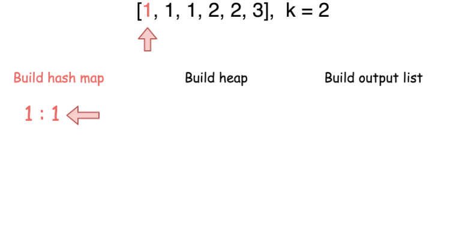

# 题目0347:前K个高频元素
## 题目描述

给定一个非空的整数数组,返回其中出现频率前k高的元素。

示例1:

```
输入: nums = [1,1,1,2,2,3], k = 2
输出: [1,2]
```

示例2:

```
输入: nums = [1], k = 1
输出: [1]
```

提示:

> 你可以假设给定的k总是合理的,且1 ≤ k ≤ 数组中不相同的元素的个数。
> 
> 你的算法的时间复杂度必须优于O(n log n),n是数组的大小。
> 
> 题目数据保证答案唯一,换句话说,数组中前k个高频元素的集合是唯一的。
> 
> 你可以按任意顺序返回答案。

## 解题技巧

* **方法1:堆**

想法:

k = 1时问题很简单,线性时间内就可以解决。只需要用哈希表维护元素出现频率,每一步更新最高频元素即可。

当k > 1就需要一个能够根据出现频率快速获取元素的数据结构,这就是优先队列。

首先建立一个元素值对应出现频率的哈希表。在Java中使用HashMap,但需要手工填值。在Python中提供一个字典结构用作哈希表和在collections库中的Counter方法去构建我们需要的哈希表。

这个步骤需要O(N)时间其中N是列表中元素个数。

第二步建立堆,堆中添加一个元素的复杂度是$O(\log(k))$,要进行N次复杂度是O(N)。

最后一步是输出结果,复杂度为$O(k\log(k))$。

在Python中可以使用heapq库中的nlargest方法,可以在相同时间内完成,但只需要一行代码解决。



```python
class Solution:
    def topKFrequent(self, nums, k):
        """
        :type nums: List[int]
        :type k: int
        :rtype: List[int]
        """ 
        count = collections.Counter(nums)   
        return heapq.nlargest(k, count.keys(), key=count.get) 
```

复杂度分析

> 时间复杂度:$O(N\log(k))$。Counter方法的复杂度是O(N),建堆和输出的复杂度是$O(N \log(k))$。因此总复杂度为$O(N + N \log(k)) = O(N \log(k))$。
> 
> 空间复杂度:O(N),存储哈希表的开销。

注释:根据复杂度分析,方法对于小k的情况是很优的。但是如果k值很大,我们可以将算法改成删除频率最低的若干个元素。
