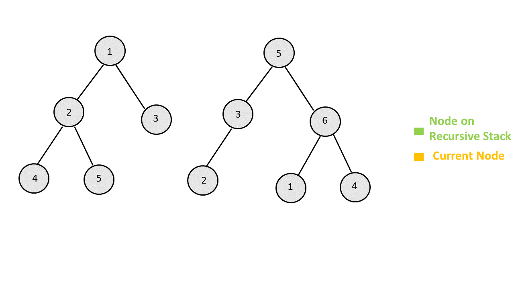

# 题目0617:合并二叉树

## 题目描述

给定两个二叉树,想象当你将它们中的一个覆盖到另一个上时,两个二叉树的一些节点便会重叠。

你需要将他们合并为一个新的二叉树。合并的规则是如果两个节点重叠,那么将他们的值相加作为节点合并后的新值,否则不为NULL的节点将直接作为新二叉树的节点。

示例1:

```
输入: 
	Tree 1                     Tree 2                  
          1                         2                             
         / \                       / \                            
        3   2                     1   3                        
       /                           \   \                      
      5                             4   7                  
输出: 
合并后的树:
	     3
	    / \
	   4   5
	  / \   \ 
	 5   4   7
注意: 合并必须从两个树的根节点开始。
```

## 解题技巧

* **方法一:递归**

我们可以对这两棵树同时进行前序遍历,并将对应的节点进行合并。在遍历时,如果两棵树的当前节点均不为空,我们就将它们的值进行相加,并对它们的左孩子和右孩子进行递归合并;如果其中有一棵树为空,那么我们返回另一颗树作为结果;如果两棵树均为空,此时返回任意一棵树均可(因为都是空)。



```java
/**
 * Definition for a binary tree node.
 * public class TreeNode {
 *     int val;
 *     TreeNode left;
 *     TreeNode right;
 *     TreeNode(int x) { val = x; }
 * }
 */
public class Solution {
    public TreeNode mergeTrees(TreeNode t1, TreeNode t2) {
        if (t1 == null)
            return t2;
        if (t2 == null)
            return t1;
        t1.val += t2.val;
        t1.left = mergeTrees(t1.left, t2.left);
        t1.right = mergeTrees(t1.right, t2.right);
        return t1;
    }
}
```

复杂度分析

> 时间复杂度:O(N),其中N是两棵树中节点个数的较小值。
> 
> 空间复杂度:O(N),在最坏情况下,会递归N层,需要O(N)的栈空间。

* **方法二:迭代**

我们也可以用迭代的方法解决这个问题。

我们首先把两棵树的根节点入栈,栈中的每个元素都会存放两个根节点,并且栈顶的元素表示当前需要处理的节点。在迭代的每一步中,我们取出栈顶的元素并把它移出栈,并将它们的值相加。随后我们分别考虑这两个节点的左孩子和右孩子,如果两个节点都有左孩子,那么就将左孩子入栈;如果只有一个节点有左孩子,那么将其作为第一个节点的左孩子;如果都没有左孩子,那么不用做任何事情。对于右孩子同理。

最后我们返回第一棵树的根节点作为答案。


```java
/**
 * Definition for a binary tree node.
 * public class TreeNode {
 *     int val;
 *     TreeNode left;
 *     TreeNode right;
 *     TreeNode(int x) { val = x; }
 * }
 */
public class Solution {
    public TreeNode mergeTrees(TreeNode t1, TreeNode t2) {
        if (t1 == null)
            return t2;
        Stack < TreeNode[] > stack = new Stack < > ();
        stack.push(new TreeNode[] {t1, t2});
        while (!stack.isEmpty()) {
            TreeNode[] t = stack.pop();
            if (t[0] == null || t[1] == null) {
                continue;
            }
            t[0].val += t[1].val;
            if (t[0].left == null) {
                t[0].left = t[1].left;
            } else {
                stack.push(new TreeNode[] {t[0].left, t[1].left});
            }
            if (t[0].right == null) {
                t[0].right = t[1].right;
            } else {
                stack.push(new TreeNode[] {t[0].right, t[1].right});
            }
        }
        return t1;
    }
}
```

复杂度分析

> 时间复杂度:O(N),其中N是两棵树中节点个数的较小值。
> 
> 空间复杂度:O(N),在最坏情况下,栈中会存放N个节点。